# Shared GPU Server --- User Monitoring Manual (Jupyter / ML)

## Overview

This guide explains how users can monitor **CPU, RAM, and GPU usage** on
a shared server environment.
# System Resources Overview

This server provides the following shared hardware resources.
All resources are shared among active users.

---

## 🧠 CPU

- **Model:** AMD EPYC 7513 32-Core Processor
- **Sockets:** 2
- **Cores per socket:** 32
- **Threads per core:** 2
- **Total Logical CPUs:** 128
- **Architecture:** x86_64
- **NUMA Nodes:** 8

⚠️ Total available compute threads: **128**
All CPU cores are shared across users.

---

## 💾 RAM (System Memory)

- **Total RAM:** 1.0 TiB (~1024 GB)
- **Swap:** Disabled (0B)

⚠️ There is NO swap space.
If RAM is exhausted, processes may be killed by the system.

---

## ⚙️ GPU Resources

- **GPU Model:** NVIDIA A100-SXM4-40GB
- **Number of GPUs:** 1
- **Total GPU Memory (VRAM):** 40 GB (40960 MiB)

⚠️ The GPU is fully shared.
All users compete for:
- 40 GB VRAM
- GPU compute (SM utilization)
- Memory bandwidth

If one job uses all 40GB VRAM, other users cannot allocate GPU memory.

---

## 💽 Storage

- **Total Storage:** 27 TB
- **Used:** 19 TB
- **Available:** 7.5 TB
- **Usage:** 72%

⚠️ Disk space is shared across users.

---

# Resource Sharing Summary

This is a high-performance shared ML server with:

- 128 CPU threads
- 1 TB RAM
- 1× NVIDIA A100 (40GB VRAM)
- 27 TB storage

All resources are shared among active users.
Please monitor your usage responsibly.


------------------------------------------------------------------------

# 1. CPU & RAM Monitoring

## 1.1 Live CPU View

``` bash
top -u $USER
```


## CPU Usage Comparison

<p align="center">
  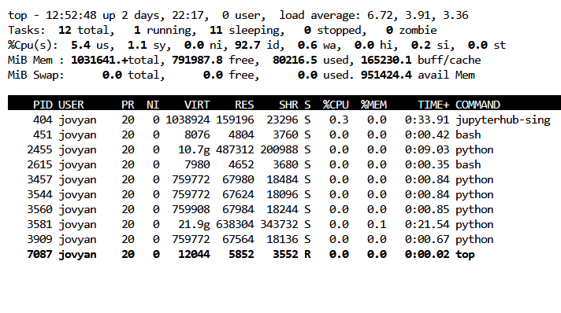
  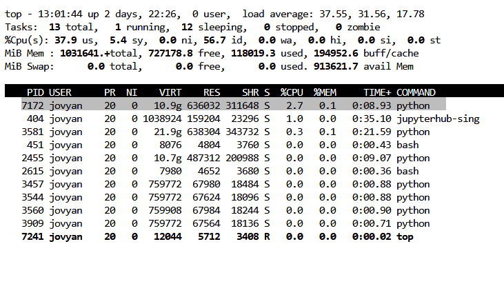
</p>

<p align="center">
  <b>Before</b> &nbsp;&nbsp;&nbsp;&nbsp;&nbsp;&nbsp;&nbsp;&nbsp;&nbsp;&nbsp;&nbsp;&nbsp;&nbsp;&nbsp;&nbsp;&nbsp;&nbsp;&nbsp;&nbsp;&nbsp;&nbsp;&nbsp;&nbsp;&nbsp;
  <b>After</b>
</p>


> [!NOTE]
> The `top` command shows that process **PID 7172** is active with **2.7% CPU utilization**. 
> The total number of running tasks has increased from **12 to 13**, confirming that a new execution thread/process has been initiated.

 


> [!Caution]
> If a process shows **CPU usage > 100%**, it is utilizing multiple cores.  
> This may indicate runaway computation or uncontrolled threading.  
> You should terminate the process and restart the kernel to restore normal resource usage.


------------------------------------------------------------------------

## 1.2 Total RAM Usage (Your Processes Only)

``` bash
ps -u $USER -o rss= | awk '{sum+=$1} END {printf "My RAM usage: %.2f GB\n", sum/1024/1024}'
```

## RAM Usage Comparison

<p align="center">
  
  
</p>

<p align="center">
  <b>Before</b> &nbsp;&nbsp;&nbsp;&nbsp;&nbsp;&nbsp;&nbsp;&nbsp;&nbsp;&nbsp;&nbsp;&nbsp;&nbsp;&nbsp;&nbsp;&nbsp;&nbsp;&nbsp;&nbsp;&nbsp;&nbsp;&nbsp;&nbsp;&nbsp;
  <b>After</b>
</p>


------------------------------------------------------------------------

## 1.3 Top RAM% & CPU% Consuming Processes

``` bash
ps -u $USER -o pid,cmd,%cpu,%mem,rss --sort=-rss | head
```

<p align="center">
  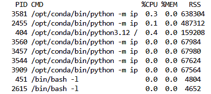
  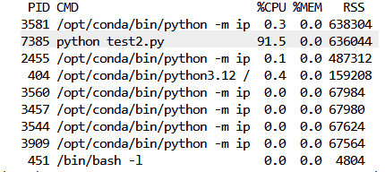
</p>

<p align="center">
  <b>Before</b> &nbsp;&nbsp;&nbsp;&nbsp;&nbsp;&nbsp;&nbsp;&nbsp;&nbsp;&nbsp;&nbsp;&nbsp;&nbsp;&nbsp;&nbsp;&nbsp;&nbsp;&nbsp;&nbsp;&nbsp;&nbsp;&nbsp;&nbsp;&nbsp;
  <b>After</b>
</p>


------------------------------------------------------------------------

# 2. GPU Monitoring

## 2.1 Snapshot View

``` bash
nvidia-smi
```


<p align="center">
  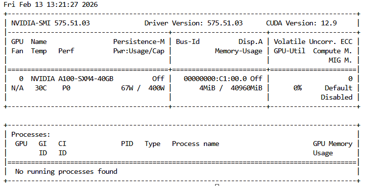
  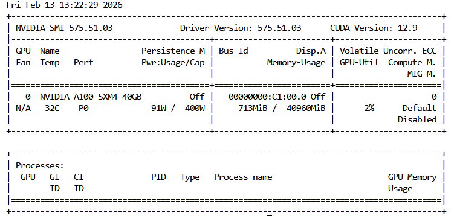
</p>

<p align="center">
  <b>Before</b> &nbsp;&nbsp;&nbsp;&nbsp;&nbsp;&nbsp;&nbsp;&nbsp;&nbsp;&nbsp;&nbsp;&nbsp;&nbsp;&nbsp;&nbsp;&nbsp;&nbsp;&nbsp;&nbsp;&nbsp;&nbsp;&nbsp;&nbsp;&nbsp;
  <b>After</b>
</p>


------------------------------------------------------------------------

## 2.2 Live Refresh View

``` bash
watch -n 1 nvidia-smi
```

<p align="center">
  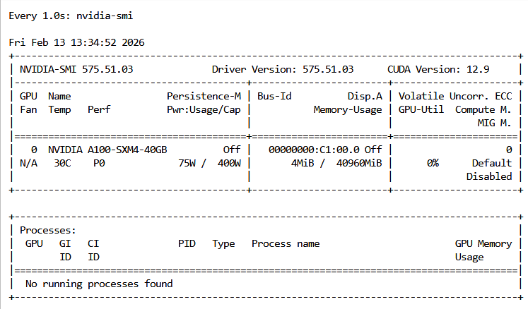
  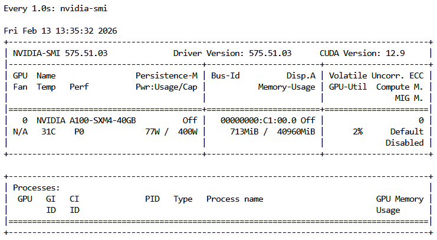
</p>

<p align="center">
  <b>Before</b> &nbsp;&nbsp;&nbsp;&nbsp;&nbsp;&nbsp;&nbsp;&nbsp;&nbsp;&nbsp;&nbsp;&nbsp;&nbsp;&nbsp;&nbsp;&nbsp;&nbsp;&nbsp;&nbsp;&nbsp;&nbsp;&nbsp;&nbsp;&nbsp;
  <b>After</b>
</p>


------------------------------------------------------------------------

## 2.3 Real-Time GPU Metrics

``` bash
nvidia-smi dmon -d 1
```

### Column Description

-   `gpu / Idx` → GPU index
-   `pwr (W)` → Power consumption
-   `gtemp (C)` → Core temperature
-   `mtemp (C)` → Memory temperature (if supported)
-   `sm (%)` → GPU compute utilization
-   `mem (%)` → Memory controller utilization
-   `mclk (MHz)` → Memory clock
-   `pclk (MHz)` → GPU core clock


<p align="center">
  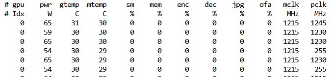
  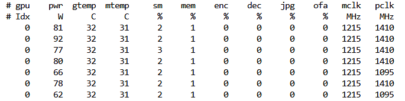
</p>

<p align="center">
  <b>Before</b> &nbsp;&nbsp;&nbsp;&nbsp;&nbsp;&nbsp;&nbsp;&nbsp;&nbsp;&nbsp;&nbsp;&nbsp;&nbsp;&nbsp;&nbsp;&nbsp;&nbsp;&nbsp;&nbsp;&nbsp;&nbsp;&nbsp;&nbsp;&nbsp;
  <b>After</b>
</p>


------------------------------------------------------------------------

# 3. Identify Your GPU Processes

``` bash
nvidia-smi --query-compute-apps=pid,process_name,used_memory --format=csv
```

<p align="center">
  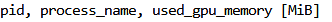
  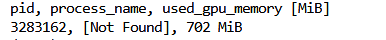
</p>

<p align="center">
  <b>Before</b> &nbsp;&nbsp;&nbsp;&nbsp;&nbsp;&nbsp;&nbsp;&nbsp;&nbsp;&nbsp;&nbsp;&nbsp;&nbsp;&nbsp;&nbsp;&nbsp;&nbsp;&nbsp;&nbsp;&nbsp;&nbsp;&nbsp;&nbsp;&nbsp;
  <b>After</b>
</p>


------------------------------------------------------------------------

# 4) Releasing RAM / VRAM (PyTorch & TensorFlow)

In a shared GPU environment, users should release memory after finishing
training or experiments. The following methods affect **only your own
Jupyter kernel / Python process**.

------------------------------------------------------------------------

## ✅ PyTorch: Free VRAM/RAM (within your notebook)

### 1) Delete large tensors / models and run garbage collection

``` python
import gc
del model
del optimizer
del loss
del batch
gc.collect()
```

### 2) Clear CUDA cache (VRAM cache)

``` python
import torch
torch.cuda.empty_cache()
```

### 3) (Optional) Clean IPC handles (useful with DataLoader multiprocessing)

``` python
import torch
torch.cuda.ipc_collect()
```

### 4) Synchronize before cleanup (ensure GPU kernels finish)

``` python
import torch
torch.cuda.synchronize()
```

### 🔹 Recommended Cleanup Combination

``` python
import gc, torch

torch.cuda.synchronize()
gc.collect()
torch.cuda.empty_cache()
torch.cuda.ipc_collect()
```

📌 Note: `empty_cache()` does not always return all VRAM to the system,
but it releases cached memory so new allocations can succeed.

------------------------------------------------------------------------

## ✅ TensorFlow / Keras: Free VRAM/RAM (within your notebook)

### 1) Clear Keras session

``` python
import tensorflow as tf
tf.keras.backend.clear_session()
```

### 2) Run garbage collection

``` python
import gc
gc.collect()
```

### 3) Prevent full VRAM pre-allocation (recommended at the TOP of your notebook)

``` python
import tensorflow as tf

gpus = tf.config.list_physical_devices('GPU')
for gpu in gpus:
    tf.config.experimental.set_memory_growth(gpu, True)
```

This prevents TensorFlow from reserving all GPU memory at startup.

------------------------------------------------------------------------

# PyTorch Training Template + Cleanup

``` python
# ===== PyTorch Training Template (shared GPU friendly) =====
import gc
import torch

device = "cuda" if torch.cuda.is_available() else "cpu"

model = ...            # your model
optimizer = ...        # your optimizer
criterion = ...        # your loss

model.to(device)
model.train()

for epoch in range(num_epochs):
    for batch in dataloader:
        x, y = batch
        x = x.to(device, non_blocking=True)
        y = y.to(device, non_blocking=True)

        optimizer.zero_grad(set_to_none=True)
        out = model(x)
        loss = criterion(out, y)
        loss.backward()
        optimizer.step()

# ===== Cleanup (ONLY affects your kernel / process) =====
del out, loss, x, y, batch
del model, optimizer, criterion

gc.collect()

if torch.cuda.is_available():
    torch.cuda.synchronize()
    torch.cuda.empty_cache()
    torch.cuda.ipc_collect()

print("PyTorch cleanup done. If VRAM still appears high, restart the kernel.")
```

------------------------------------------------------------------------

# TensorFlow / Keras Training Template + Cleanup

``` python
# ===== TensorFlow/Keras Training Template (shared GPU friendly) =====
import gc
import tensorflow as tf

# Put this at the TOP of your notebook
gpus = tf.config.list_physical_devices('GPU')
for gpu in gpus:
    try:
        tf.config.experimental.set_memory_growth(gpu, True)
    except Exception:
        pass

model = ...  # tf.keras.Model(...)
model.compile(...)
model.fit(...)

# ===== Cleanup (ONLY affects your kernel / process) =====
tf.keras.backend.clear_session()
del model
gc.collect()

print("TensorFlow cleanup done. If VRAM still appears high, restart the kernel.")
```

------------------------------------------------------------------------

## ⚠ Important

If memory does not fully drop after cleanup, **restart the Jupyter
kernel**.

This is the only 100% reliable way to release all RAM/VRAM from your
session.


------------------------------------------------------------------------


# 6) Restarting and Shutting Down Kernels (JupyterHub)

In a shared GPU environment, properly restarting or shutting down your
kernel ensures that RAM and GPU memory (VRAM) are released.

This section explains:

-   What each action does
-   When to use it
-   What happens internally
-   Why it matters on shared infrastructure

------------------------------------------------------------------------

## 🟢 1️⃣ Kernel Running (Before)

When your notebook is active, you will see it under the **KERNELS**
section:

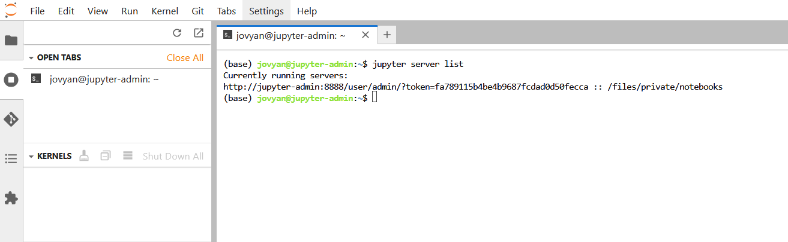

This means: - A Python process is running - RAM is allocated - GPU
memory may be allocated - Resources are reserved for your session

------------------------------------------------------------------------

## 🔴 2️⃣ Shut Down All Kernels

Click:

    KERNELS → Shut Down All

You will see a confirmation dialog:


Press **Shut Down All**

### What happens internally?

-   All your notebook kernel processes are terminated
-   RAM is freed
-   GPU memory is released
-   Your notebooks remain saved
-   Other users are NOT affected

------------------------------------------------------------------------

## ⚠ 3️⃣ Server Becomes Unavailable

After shutdown, you may see:

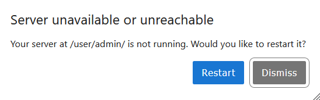

This means: - Your personal Jupyter server process has stopped - Your
session is no longer active

This is expected behavior.

------------------------------------------------------------------------

## 🔄 4️⃣ Restart the Server

Click:

    Restart

You will then see:

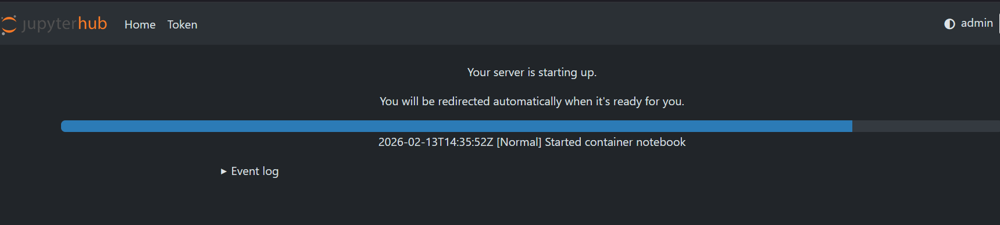

This means:

-   A fresh container / process is starting
-   A new clean Python environment is being created
-   All memory is reset
-   GPU memory is fully released

Once complete, you are redirected back automatically.

------------------------------------------------------------------------

## 🧠 What Is Actually Restarted?

JupyterHub architecture:

User → Kernel → Notebook Server → Hub

When you click **Shut Down All**:

-   The Kernel is stopped
-   The Notebook server may also stop
-   Your container/session may terminate

When you click **Restart**:

-   A brand-new clean server instance starts
-   New Python processes are created\
-   Old memory allocations are gone

------------------------------------------------------------------------

## 📌 When Should You Use Restart?

Use Restart when:

-   GPU memory does not drop
-   You get CUDA Out Of Memory errors
-   You ran many experiments in the same notebook
-   RAM usage seems stuck
-   You want a fully clean state

------------------------------------------------------------------------

## 🛑 When Should You Use Shut Down?

Use Shut Down when:

-   You finished working
-   You are leaving the server
-   You want to free GPU for others
-   You see idle notebooks running

------------------------------------------------------------------------

## 🔬 Why This Is Important on Shared GPU Servers

This server provides:

-   128 CPU threads (shared)
-   1 TB RAM (shared)
-   1× NVIDIA A100 (40GB VRAM shared)

If users do not shut down idle kernels:

-   GPU memory remains allocated
-   RAM stays reserved
-   Other users may experience OOM errors
-   Training jobs may fail

Restarting ensures:

-   Clean memory state
-   Fair resource usage
-   Stable shared environment

------------------------------------------------------------------------

## 🏆 Recommended Best Practice

After finishing a heavy experiment:

1.  Shut Down the notebook
2.  Restart your server
3.  Confirm GPU memory dropped using:

``` bash
nvidia-smi
```

If unsure:

> Restart is always safe. It affects only your session.


------------------------------------------------------------------------
# 7) CPU Thread Limits (Very Important)
> [!WARNING]
>  You MUST limit CPU threads before importing NumPy 
> PyTorch / TensorFlow.\
> Otherwise, the limits may not take effect and performance can degrade.

>This prevents a single training job from using dozens of CPU threads on a shared server.

------------------------------------------------------------------------

## Why This Matters

This server has **128 CPU threads**.

Without limits:

-   One training job may use 32--64 threads
-   Multiple users can oversubscribe CPU
-   Performance degrades for everyone

Setting thread limits ensures fair CPU usage.

------------------------------------------------------------------------

## Option A --- Inside Python (Notebook or Script)

Place this at the VERY TOP of your file, **before any imports**:

``` python
import os

os.environ["OMP_NUM_THREADS"] = "1"
os.environ["OPENBLAS_NUM_THREADS"] = "1"
os.environ["MKL_NUM_THREADS"] = "1"
os.environ["VECLIB_MAXIMUM_THREADS"] = "1"
os.environ["NUMEXPR_NUM_THREADS"] = "1"

import numpy as np
import torch
import tensorflow as tf
```

This limits linear algebra operations to **1 CPU thread per run**.

You only need to place this once at the top.\
Not in every cell.

------------------------------------------------------------------------

## Option B --- From Terminal (Per Run)

If running a script:

``` bash
OMP_NUM_THREADS=1 OPENBLAS_NUM_THREADS=1 MKL_NUM_THREADS=1 NUMEXPR_NUM_THREADS=1 python train.py
```

This applies only to that specific execution.

------------------------------------------------------------------------

## Option C --- 'Permanent'

Add this to your `~/.bashrc`:

``` bash
export OMP_NUM_THREADS=1
export OPENBLAS_NUM_THREADS=1
export MKL_NUM_THREADS=1
export VECLIB_MAXIMUM_THREADS=1
export NUMEXPR_NUM_THREADS=1
```

Then apply it:

``` bash
source ~/.bashrc
```

This applies to all future runs for your user account.

------------------------------------------------------------------------

## What Does This Actually Limit?

These variables limit CPU threads used by:

-   NumPy
-   PyTorch (CPU operations)
-   TensorFlow (CPU operations)
-   BLAS / OpenMP backends

They do NOT limit:

-   GPU usage
-   DataLoader multiprocessing workers
-   Other system processes

------------------------------------------------------------------------

# Best Practices

-   Close unused notebooks.
-   Avoid running multiple heavy jobs simultaneously.
-   Monitor your usage before starting training.
-   Use reasonable batch sizes.
-   Restart kernels after heavy workloads.
